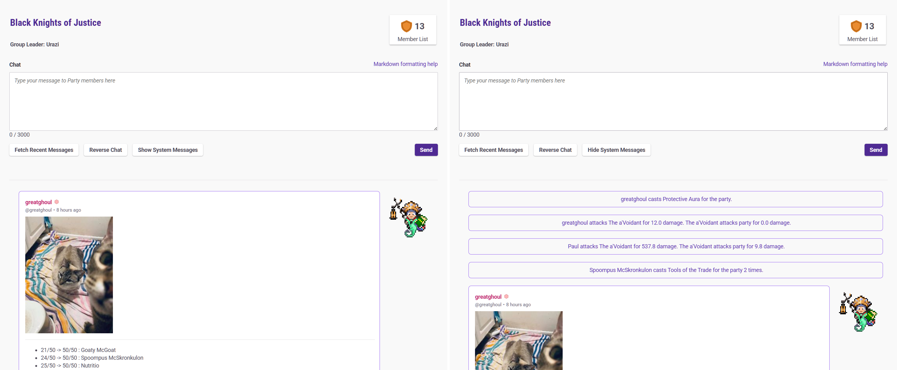

# HabitRPG - Hide System Messages in Party

Toggle part system message visiability, hide by default.

[INSTALL USERSCRIPT](https://github.com/greatghoul/habitrpg_userscripts/raw/refs/heads/main/Hide%20System%20Messages%20in%20Party/main.user.js)
 
